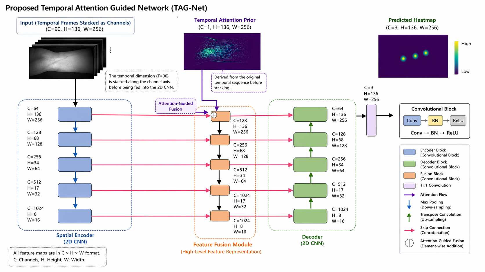
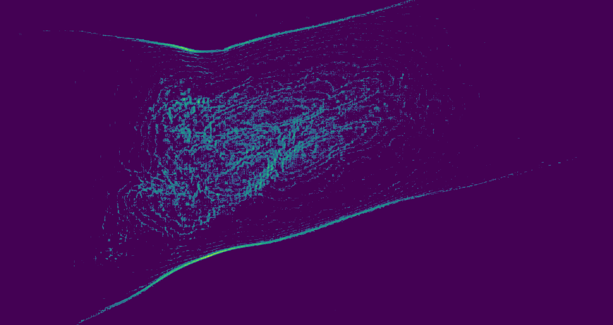
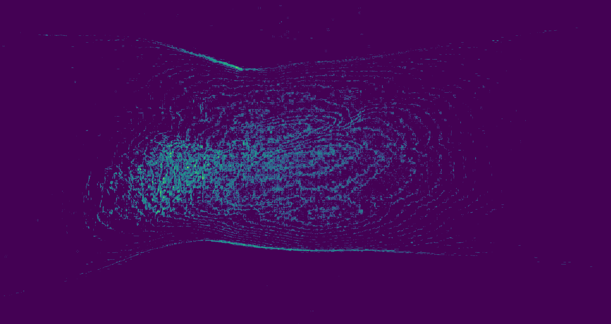
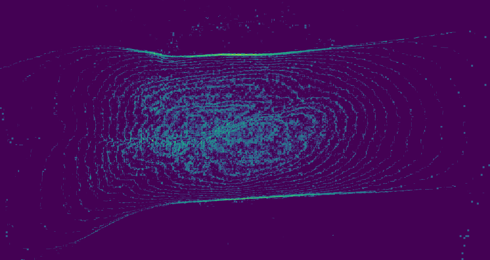

# PLNTP: Pulse Localization Network with Temporal Prior

**Guanhao Huang, Hong Lu**  
Shanghai Key Laboratory of Intelligent Information Processing, School of Computer Science  
Fudan University, P.R. China

---

## Overview

PLNTP is a heatmap-based deep learning framework for simultaneously localizing the three Traditional Chinese Medicine (TCM) pulse positions — **cun (寸)**, **guan (關)**, and **chi (尺)** — from infrared wrist videos.

Key contributions:
- First work to **simultaneously localize all three pulse points** using a heatmap-based approach on high-resolution infrared video
- A lightweight **Temporal Attention Prior** that exploits subtle periodic pulse motion across video frames, inspired by Eulerian Video Magnification
- A **Circular Region Expectation** keypoint fitting strategy that reduces integer-rounding bias from heatmap peak extraction

---

## Method

The network adopts **U-Net** as the backbone. A Temporal Attention Prior is computed from 90-frame infrared video by accumulating absolute frame differences from the mean frame, then thresholded to produce a binary attention map highlighting pulse-active regions.

The prior is fused into the decoder via **convolution followed by concatenation** on the skip connections (selected based on ablation study).



### Temporal Attention Prior Examples

| | |
|---|---|
|  |  |
|  |  |

---

## Results

### Comparison with Heatmap-Based Methods (Test set: 295 samples)

| Model | Params | Cun 20px | Guan 20px | Chi 20px |
|---|---|---|---|---|
| Hourglass | 56M | 12.2% | 17.3% | 13.6% |
| CPN | 110M | 13.9% | 15.3% | 15.3% |
| Flat-net | 4M | 8.8% | 9.5% | 6.8% |
| RSN | 105M | 14.6% | 16.3% | 13.9% |
| U-Net | 39M | 15.9% | 20.0% | 19.3% |
| **PLNTP (Ours)** | **51M** | **24.4%** | **26.4%** | **21.4%** |

At the 100-pixel (10 mm) threshold, PLNTP achieves **97.97%**, **97.29%**, and **97.63%** for cun, guan, and chi respectively.

---

## Build

Requires a LaTeX distribution (TeX Live or MiKTeX).

```bash
pdflatex main.tex && bibtex main && pdflatex main.tex && pdflatex main.tex
```

The compiled paper is also available as [`main.pdf`](main.pdf).

---

## Acknowledgements

This work was conducted using computational resources and facilities provided by **Fudan University**. The authors are affiliated with the Shanghai Key Laboratory of Intelligent Information Processing, School of Computer Science, Fudan University, P.R. China.

---

## Disclaimer

This repository contains the manuscript source and figures for personal academic archiving purposes. The work was completed as part of research activities at Fudan University.

- The dataset used in this work is **not publicly released** and remains proprietary.
- This manuscript has **not been peer-reviewed**.
- Results reported are based on our internal test set and may not generalize to other datasets or settings.
- The authors make no warranties regarding the accuracy, completeness, or fitness for any particular purpose of the content herein.

---

## License

This work is licensed under a [Creative Commons Attribution 4.0 International License (CC BY 4.0)](https://creativecommons.org/licenses/by/4.0/).

You are free to share and adapt this work for any purpose, provided appropriate credit is given to the original authors.

---

## Citation

If you find this work useful, please consider citing:

```bibtex
@article{huang2025plntp,
  title={PLNTP: Pulse Localization Network with Temporal Prior},
  author={Huang, Guanhao and Lu, Hong},
  year={2025}
}
```
